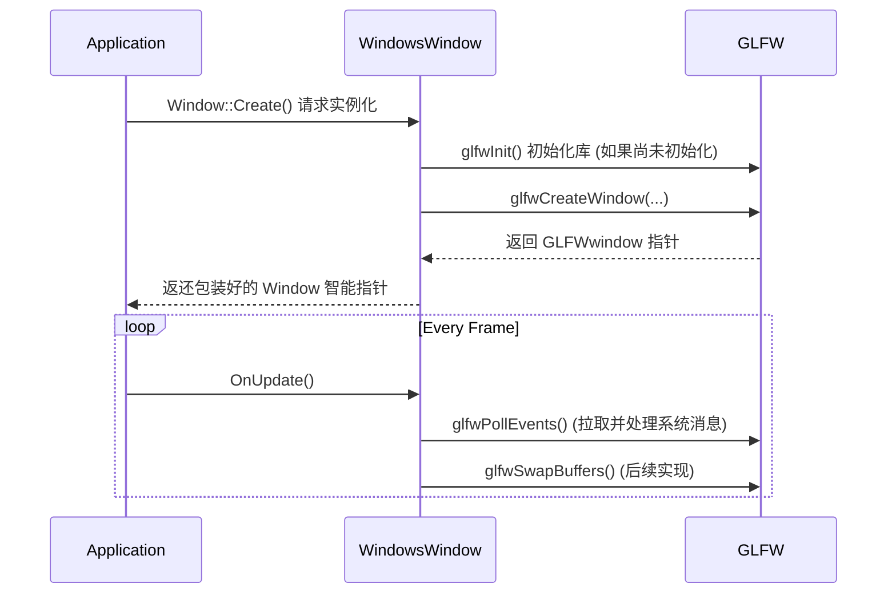

# Window Abstraction

## 1. 为什么需要 Window 抽象 (Why)

在不同操作系统（Windows, macOS, Linux）上创建窗口和呈现画面的底层 API 差异巨大（例如 Windows 使用 Win32 API，Linux 使用 X11 或 Wayland）。如果我们直接把操作系统提供的底层代码塞进 `Application` 甚至各处渲染逻辑中，引擎将完全失去跨平台能力。

因此，我们需要设计一层**窗口系统抽象层 (Window Abstraction)**：
1. **统一 API**：对引擎其余部分提供一致的方法来获取窗口的高、宽，或者订阅窗口产生的系统事件（例如按键、鼠标操作）。
2. **隐藏实现细节**：对于开发者和引擎的其他模块，不关心底层是使用 `GLFW`、`SDL` 还是手写的 `Win32`。
3. **渲染上下文的载体**：图形渲染 API (如 OpenGL、Vulkan) 需要一个平台环境即「Context」才能在屏幕上画出东西，而这些通常和窗口是强绑定的。

**为什么选择 GLFW**：
对于桌面级应用程序来说，**GLFW** 是一个极其成熟、轻量且天然支持多平台的 C 库。它的主要职责就是“打开窗口，处理简单的键鼠输入，并创建适用于 OpenGL 等图形库的 Context（渲染上下文）”。这样我们就可以避免从头手撸浩如烟海且难以维护的跨平台原生窗口脚手架代​​码。

## 2. 核心架构与设计 (How)

### `GE::Window` 接口类

`GE::Window` 规定了引擎中任何平台下的 Window 必须具备的行为，作为一个纯接口（C++ 抽象基类）存在。
主要方法包括：
*   **状态获取**：`GetWidth()`, `GetHeight()`
*   **事件分发对接**：`SetEventCallback(...)` 返回窗口底层的各类事件给 `Application` 的事件总线处理。
*   **垂直同步控制**：`SetVSync()`, `IsSync()`
*   **创建入口**：`static Window* Create(...)` —— 这是一个**工厂方法**，根据编译时确定的操作系统宏自动返回适配该系统的窗口实例。

### `GE::WindowsWindow` 实现类

这是针对 Windows 平台的 `Window` 派生类。
在这个类中，我们实际上引入了 `GLFW` 的相关代码：
*   使用 `glfwInit()` 和 `glfwCreateWindow()` 进行核心配置。
*   在 `OnUpdate()` 时通过调用 `glfwPollEvents()` 来拉取操作系统派发给窗口的消息。
*   将由于窗口回调（例如尺寸更改、关闭请求）触发的 GLFW 响应包装成游戏引擎自定的 `Event` 结构，发回给 `EventCallbackFn` (主要交给并由 `Application` 进行主事件处理)。

## 3. 生命周期与工作流

基于目前的实现，其流转生命周期大体如下：

